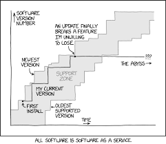

 

## Conda+Python-3 based IMP install

This script builds Python-3 compatible minimal versions of the Sali-lab
software IMP. For quick-and-dirty builds as well as more extensive protocols,
please see the [IMP documentation](https://integrativemodeling.org/2.13.0/doc/manual/installation.html)

You can disable certain IMP modules in the build process. Some 'heavy' modules
can be auto-disabled with the ```-m [--minimal_install]``` option. Some of these
modules are prone to breaking comptability in an entirely conda based install,
so it might be a good idea to do a minimal install if you need IMP only for
application / production purposes and not method development.

### Required
Python-3 Anaconda (or Miniconda) distribution.
This is an entirely conda based installation, so it'll create its own
environment. Together with IMP, post-processing and analysis tools imp-sampcon
and PMI_Analysis are also installed.

### Supported platforms:
a) Linux (tested on Fedora-31, Ubuntu-20.04, WIP: UCSF Wynton cluster)

b) Mac OSX Mojave (WIP)

### Output directory structure:
The outdir can be optionally specified and defaults to ```./salilab```.
IMP, PMI_Analysis and imp-sampcon are extracted respectively into ```outdir/imp```,
```outdir/pmi_analysis``` and ```outdir/imp-sampcon```.
IMP is built into ```outdir/imp_release```

### Author:
Tanmoy Sanyal,
Sali lab
